### Етап 1: Базове налаштування та перевірка Jenkins
Починаємо з розгортання Jenkins та створення найпростішої збірки для перевірки працездатності інфраструктури.

|  |
| ------------------------------------ |
| Встановлений Jenkins                 |

|  |
| ------------------------------------ |
| Підключення через SSH (Копіювання публічного ключа на цільовий сервер) |

|                      |
| -------------------------------------------------------- |
| Налаштування базового білду (виконання тестової команди) |

---

### Етап 2: Підготовка до деплою по SSH
Щоб Jenkins міг відправляти файли на наш веб-сервер, встановлюємо необхідний плагін та налаштовуємо права доступу на цільовій машині.

| 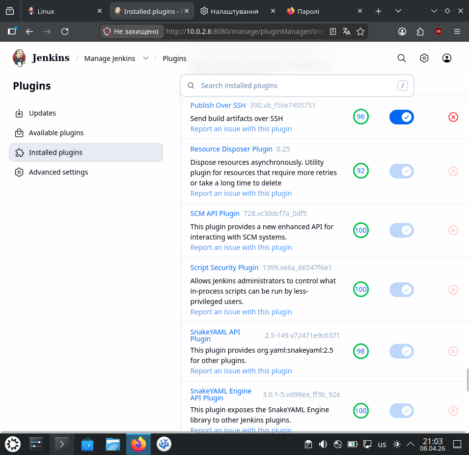 |
| ------------------------------- |
| Встановлення плагіну Publish Over SSH |

| 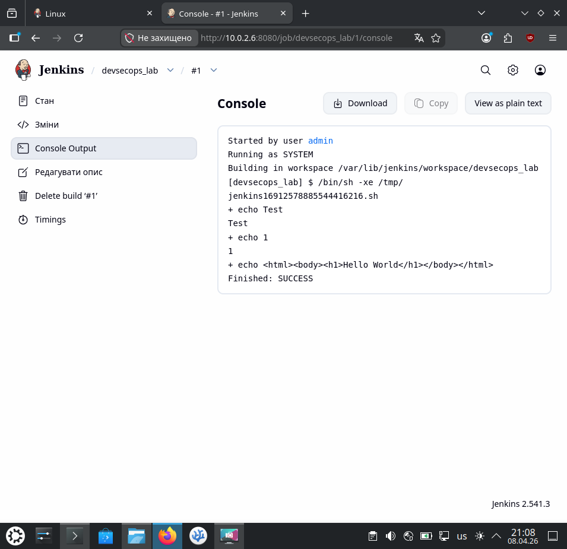 |
| ------------------------------- |
| Консольний вивід: успішне виконання базової тестової збірки |

| 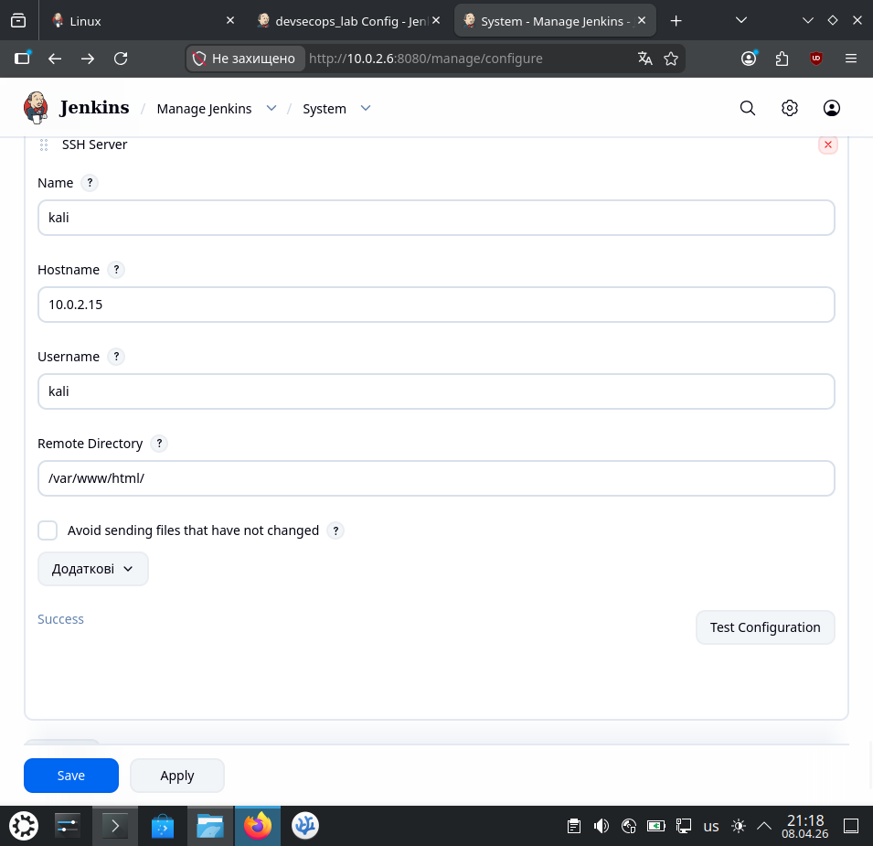 |
| ------------------------------- |
| Налаштування параметрів цільового SSH-сервера у глобальній конфігурації Jenkins |

| 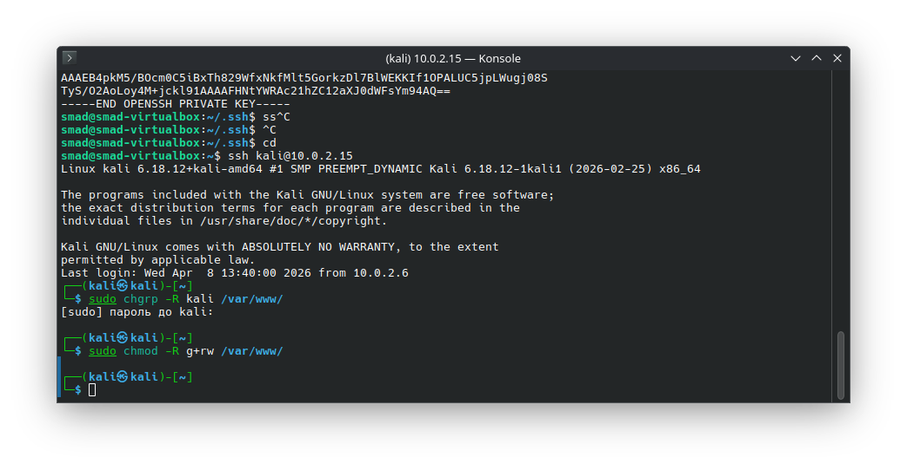 |
| ------------------------------- |
| Налаштування прав доступу (chgrp, chmod) до папки /var/www на цільовому сервері |

---

### Етап 3: Налаштування та перевірка деплою
Додаємо крок передачі файлів у нашу джобу. Jenkins відправлятиме зібраний `index.html` безпосередньо на веб-сервер.

| 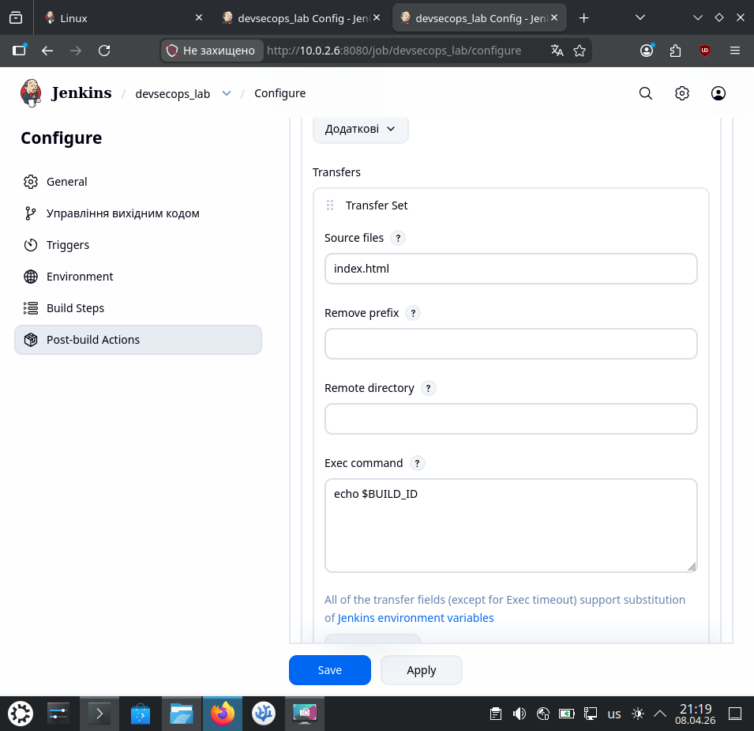 |
| ------------------------------- |
| Додавання кроку Send files or execute commands over SSH у налаштуваннях джоби |

| 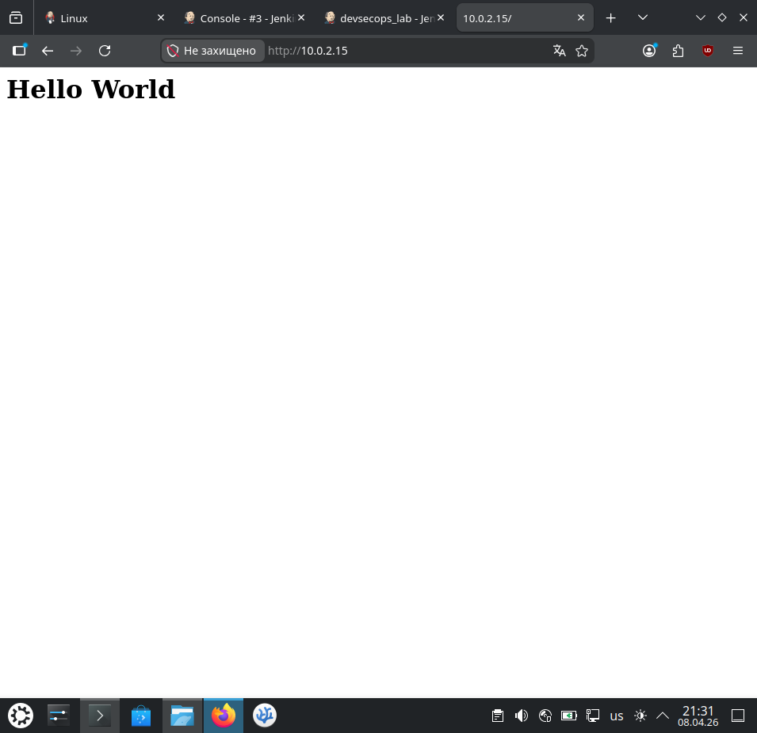 |
| ------------------------------- |
| Успішний деплой: веб-сторінка завантажилась у браузері |

---

### Етап 4: Інтеграція з системою контролю версій (GitHub)
Наступний крок еволюції CI/CD — Jenkins повинен автоматично підтягувати актуальний код з Git-репозиторію перед тим, як його деплоїти.

| 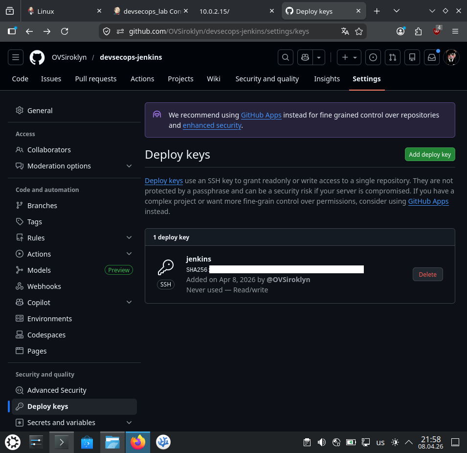 |
| ------------------------------- |
| Додавання Deploy Key у налаштуваннях репозиторію GitHub |

| 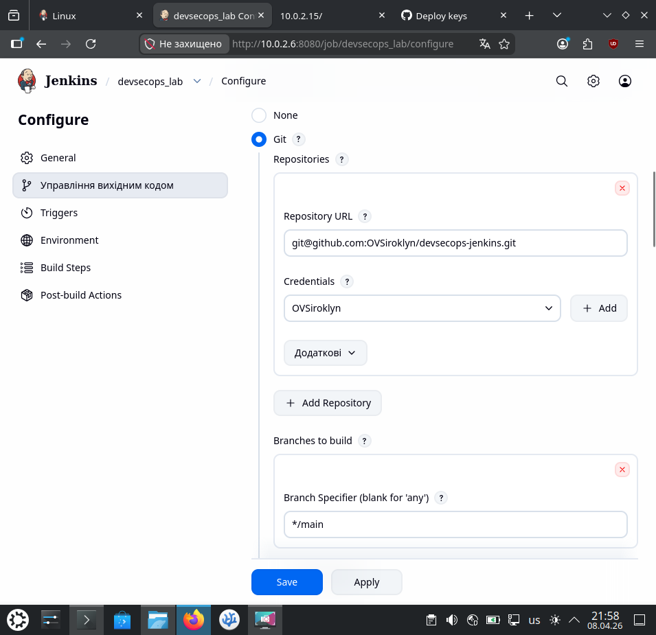 |
| ------------------------------- |
| Налаштування Source Code Management (Git) у Jenkins |

|  |
| ------------------------------- |
| Налаштування Credentials для підключення до репозиторію по SSH |

| 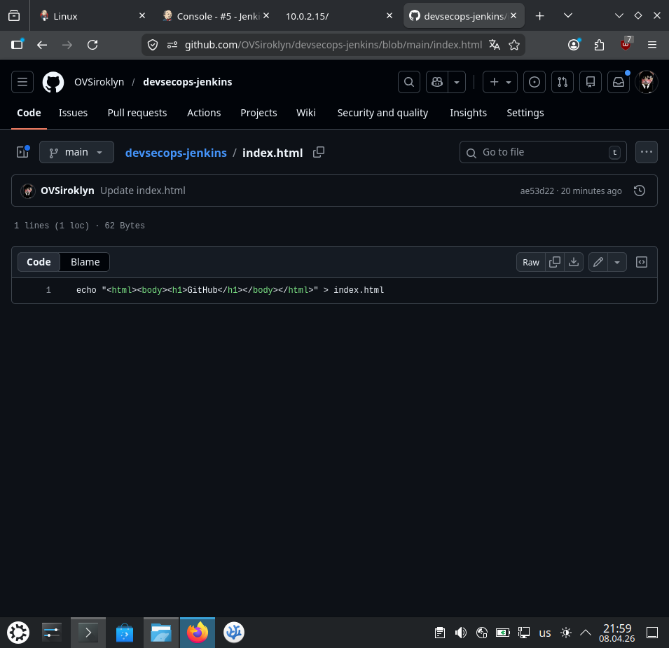 |
| ------------------------------- |
| Вказування Repository URL та інтеграція Git із кроком деплою |

| 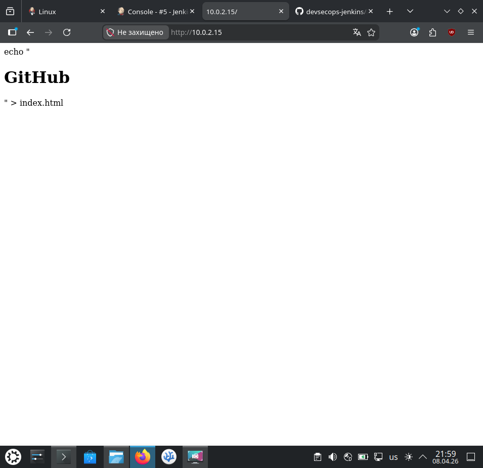                                             |
| --------------------------------------------------------------------------- |
| Консольний вивід: успішне клонування репозиторію та відправка файлів по SSH |

---

### Етап 5: Pipeline as Code
Переходимо від звичайних Freestyle-проектів до сучасного формату Pipeline для гнучкого контролю над етапами CI/CD як кодом.

| 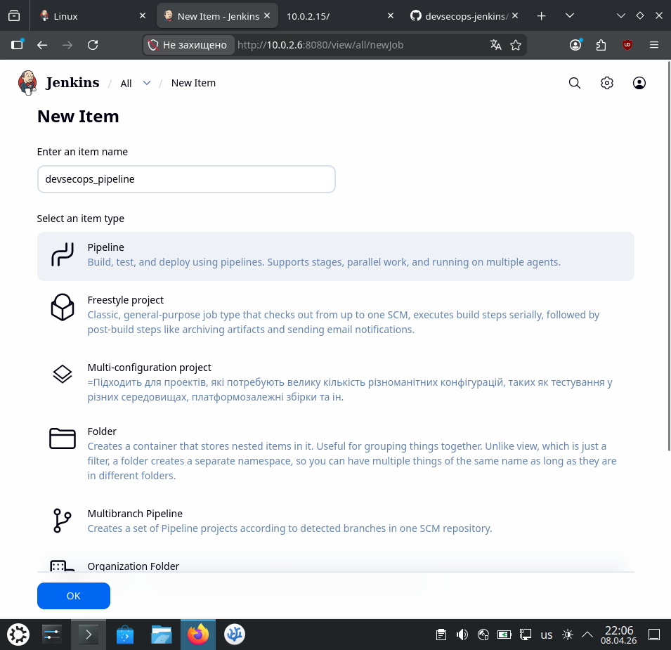 |
| ------------------------------- |
| Створення нового проекту формату Pipeline |

| 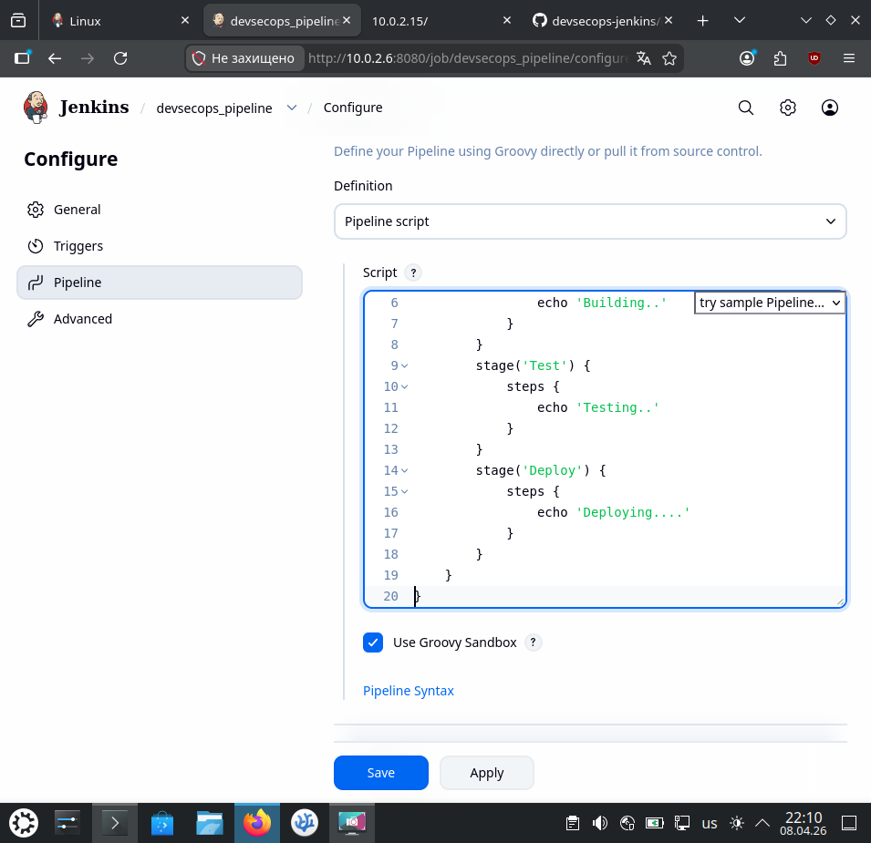 |
| ------------------------------- |
| Написання декларативного Pipeline скрипта з розбивкою на етапи (Stages) |

|  |
| ------------------------------- |
| Запуск задачі |
